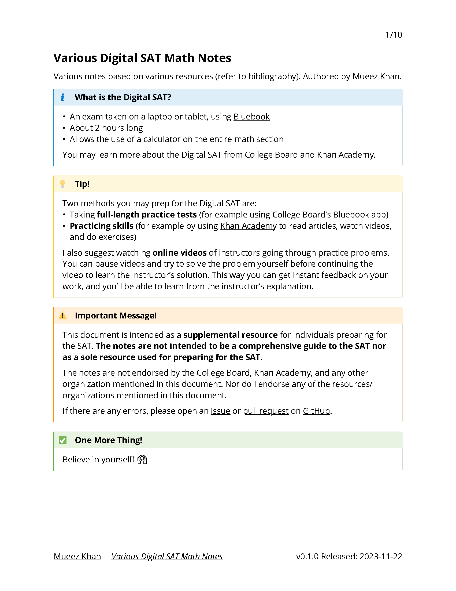

# 📝 Various Digital SAT Math Notes

A **supplemental resource** of notes based on various resources for individuals studying for the Digital SAT's math section.

## **[View notes.pdf for the compiled notes.](notes.pdf)**

## 📚 Tech Stack

-   [Typst](https://typst.app) - Typesetting system
-   [release-it](https://github.com/release-it/release-it) - Release management

## 📢 Disclaimer

Organized by [Mueez Khan](https://www.mueezkhan.com), based on material(s) attributed within the notes.

If there are any errors in this document, please let me know by [contacting me](https://www.mueezkhan.com/contact) or opening an [issue](https://github.com/rzmk/various-dsat-math-notes/issues) and/or [pull request](https://github.com/rzmk/various-dsat-math-notes/pulls). Fixes are greatly appreciated!

<!--

Notes for maintainer(s):

On release:

- Update footer with new version number
- (optional) Update cover page image (cover.png) with new version number

-->
